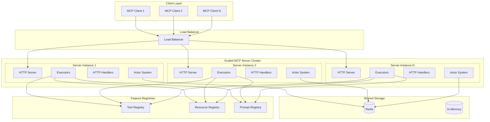
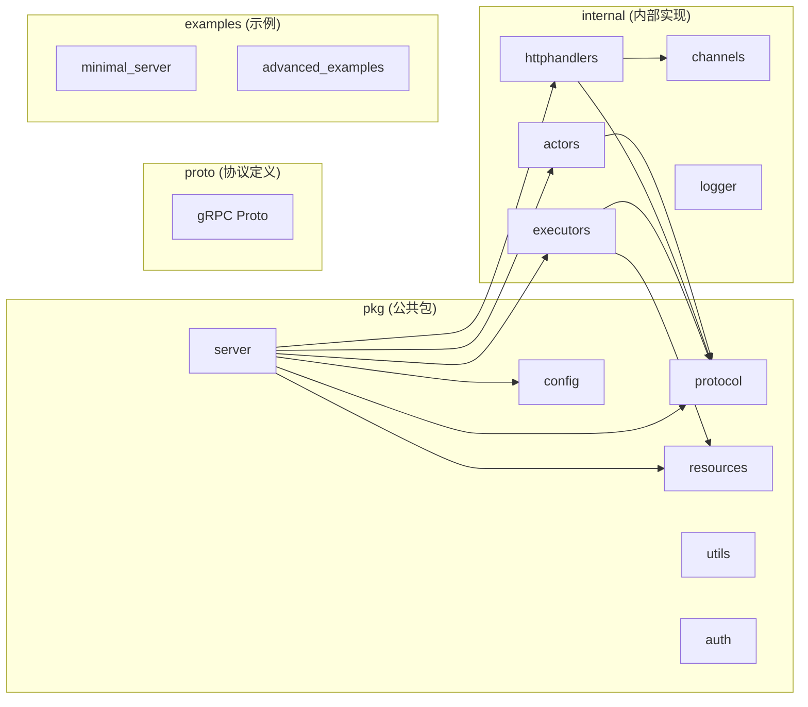
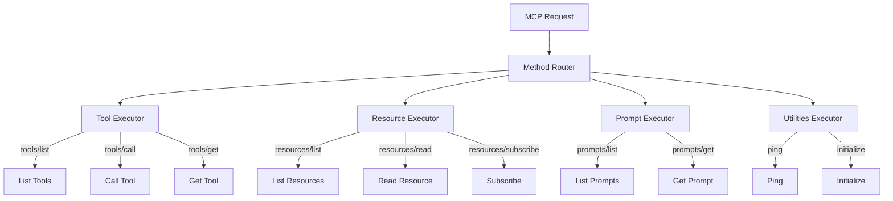
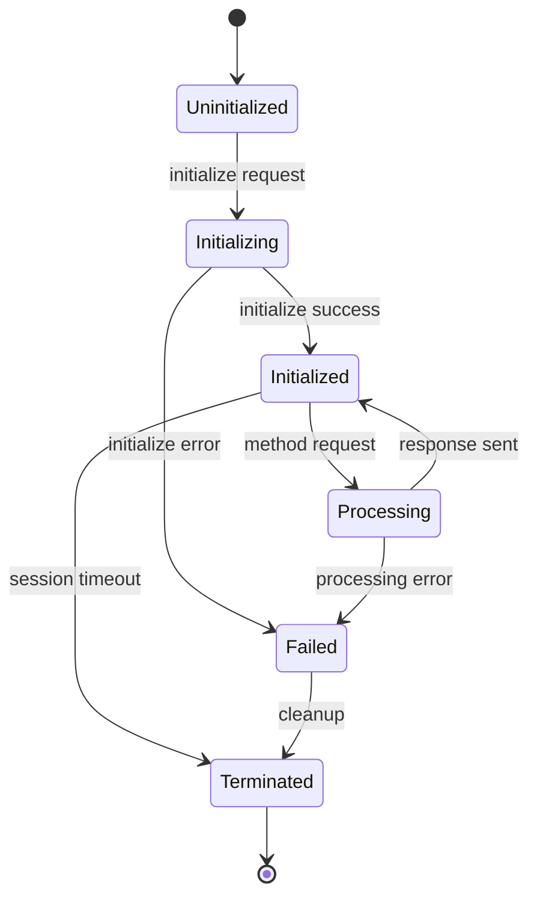
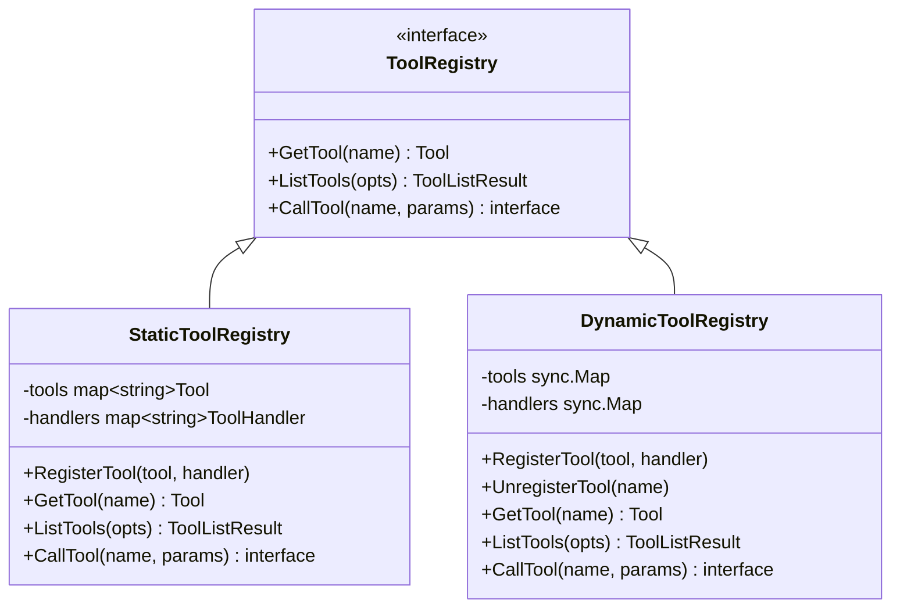
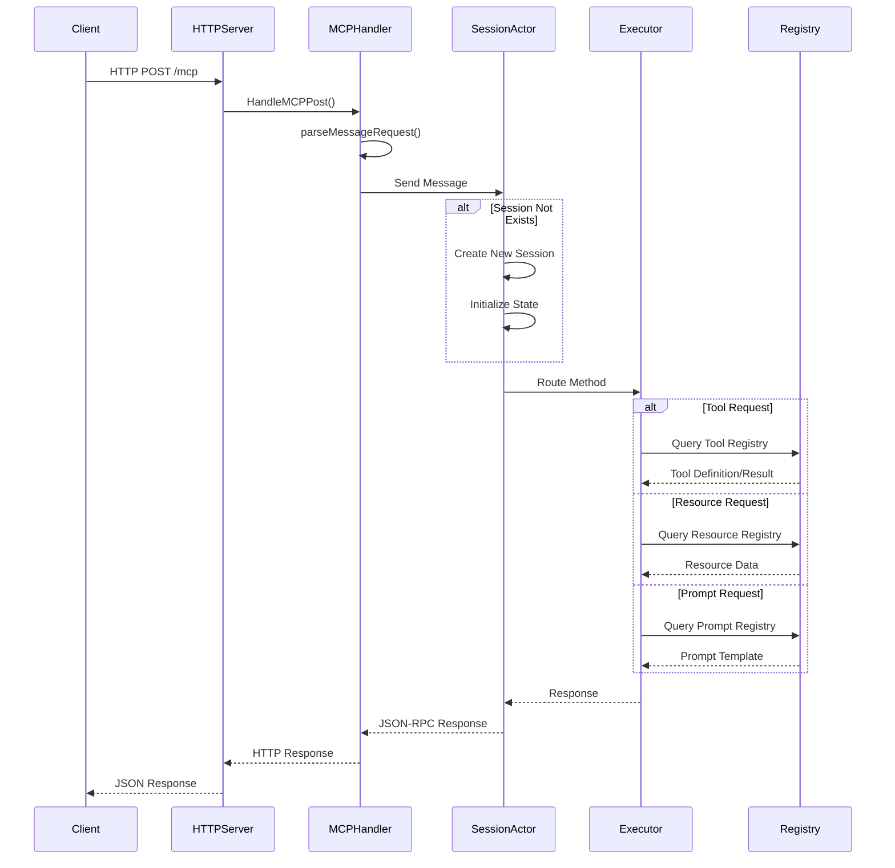
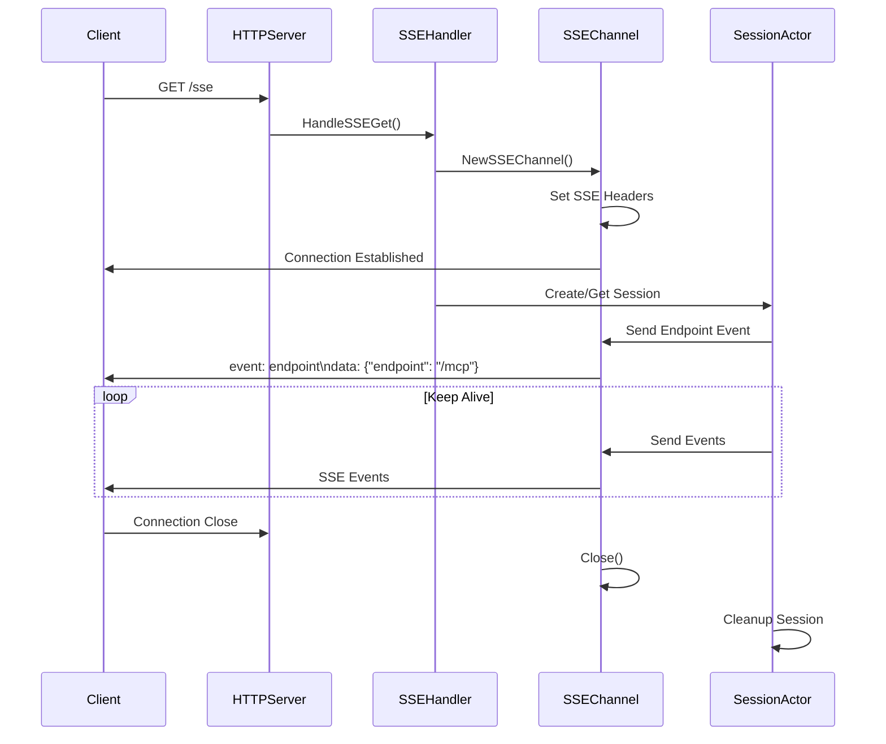

# Scaled MCP Server - Quick Start Guide

## 项目概述

Scaled MCP Server 是一个基于 Go 语言实现的可水平扩展的 MCP (Message Context Protocol) 服务器。该项目实现了 MCP 2025-03 规范，支持负载均衡部署，采用 Actor 模型架构进行会话管理和消息路由。

## 核心特性

- **HTTP 传输**: 灵活的 HTTP 传输，支持主要的 `/mcp` 端点、可选的 SSE 端点和能力协商
- **会话管理**: 分布式会话管理，支持 Redis 或内存存储选项
- **Actor 系统**: 使用基于 Actor 的架构处理会话和消息路由
- **水平扩展**: 支持跨多个节点的负载均衡部署
- **工具注册**: 支持静态和动态工具注册
- **资源管理**: 完整的资源管理和订阅机制

## 项目架构

### 整体架构图



### 核心模块结构



## 关键模块分析

### 1. 服务器核心 (McpServer)

**位置**: `pkg/server/mcp_server.go`

`McpServer` 是整个系统的核心，负责:
- HTTP 服务器管理
- Actor 系统初始化
- 路由配置
- 功能注册表管理
- 认证和追踪处理

**关键结构**:
```go
type McpServer struct {
    Handlers           *httphandlers.MCPHandler
    config             *config.ServerConfig
    actorSystem        actor.ActorSystem
    serverCapabilities protocol.ServerCapabilities
    featureRegistry    resources.FeatureRegistry
    executors          *executors.Executors
    // ...
}
```

### 2. 协议处理 (Protocol)

**位置**: `pkg/protocol/types.go`

定义了 MCP 协议的核心数据结构:
- `JSONRPCMessage`: JSON-RPC 消息格式
- `Tool`: 工具定义
- `InitializeParams/Result`: 初始化参数和结果
- `ClientCapabilities/ServerCapabilities`: 客户端和服务器能力

### 3. 执行器系统 (Executors)

**位置**: `internal/executors/`

执行器系统负责处理不同类型的 MCP 请求:



### 4. Actor 系统 (Session Management)

**位置**: `internal/actors/mcp_session_state_machine.go`

Actor 系统管理会话状态和生命周期:



### 5. 资源注册表 (Resource Registries)

**位置**: `pkg/resources/`

支持多种注册表类型:
- **静态注册表**: 预定义的工具和资源
- **动态注册表**: 运行时注册和管理



## 请求处理流程

### HTTP 请求处理时序图



### SSE 连接处理流程



## 快速开始

### 1. 基本安装

```bash
go get github.com/traego/scaled-mcp@latest
```

### 2. 最小服务器示例

```go
package main

import (
    "context"
    "log/slog"
    "os"
    "os/signal"
    "syscall"
    "time"

    "github.com/traego/scaled-mcp/pkg/config"
    "github.com/traego/scaled-mcp/pkg/server"
)

func main() {
    ctx, cancelAll := context.WithCancel(context.Background())

    // 配置日志
    slog.SetDefault(slog.New(slog.NewTextHandler(os.Stdout, &slog.HandlerOptions{
        Level: slog.LevelInfo,
    })))

    // 创建服务器配置
    cfg := config.DefaultConfig()
    cfg.BackwardCompatible20241105 = true
    cfg.HTTP.Port = 9985

    // 创建 MCP 服务器
    mcpServer, err := server.NewMcpServer(cfg)
    if err != nil {
        slog.Error("Failed to create MCP server", "error", err)
        os.Exit(1)
    }

    // 启动服务器
    if err := mcpServer.Start(ctx); err != nil {
        slog.Error("Failed to start MCP server", "error", err)
        os.Exit(1)
    }

    slog.Info("MCP server started", "port", cfg.HTTP.Port)

    // 等待终止信号
    quit := make(chan os.Signal, 1)
    signal.Notify(quit, syscall.SIGINT, syscall.SIGTERM)
    <-quit

    slog.Info("Shutting down MCP server...")

    ctx, cancel := context.WithTimeout(context.Background(), 10*time.Second)
    defer cancel()

    cancelAll()
    mcpServer.Stop(ctx)

    slog.Info("MCP server stopped")
}
```

### 3. 带工具注册的服务器

一个更完整的示例，展示了如何注册一个静态工具并处理其调用，同时包含优雅的服务器启动和关闭逻辑。

```go
package main

import (
	"context"
	"fmt"
	"log/slog"
	"os"
	"os/signal"
	"syscall"
	"time"

	"github.com/traego/scaled-mcp/pkg/config"
	"github.com/traego/scaled-mcp/pkg/resources"
	"github.com/traego/scaled-mcp/pkg/server"
)

func main() {
	ctx, cancelAll := context.WithCancel(context.Background())

	// 配置日志
	slog.SetDefault(slog.New(slog.NewTextHandler(os.Stdout, &slog.HandlerOptions{
		Level: slog.LevelInfo,
	})))

	// 创建服务器配置
	cfg := config.DefaultConfig()
	cfg.Session.UseInMemory = true // For example purposes

	// 创建静态工具注册表
	registry := resources.NewStaticToolRegistry()

	// 定义计算器工具
	calculatorTool := resources.NewTool("calculator").
		WithDescription("Performs basic arithmetic operations").
		WithInputs([]resources.ToolInput{
			{
				Name:        "operation",
				Type:        "string",
				Description: "Operation to perform (add, subtract, multiply, divide)",
				Required:    true,
			},
			{
				Name:        "a",
				Type:        "number",
				Description: "First operand",
				Required:    true,
			},
			{
				Name:        "b",
				Type:        "number",
				Description: "Second operand",
				Required:    true,
			},
		}).
		Build()

	// 定义工具处理函数
	calculatorHandler := func(ctx context.Context, params map[string]interface{}) (interface{}, error) {
		operation, ok := params["operation"].(string)
		if !ok {
			return nil, fmt.Errorf("%w: operation must be a string", resources.ErrInvalidParams)
		}

		a, ok := params["a"].(float64)
		if !ok {
			return nil, fmt.Errorf("%w: a must be a number", resources.ErrInvalidParams)
		}

		b, ok := params["b"].(float64)
		if !ok {
			return nil, fmt.Errorf("%w: b must be a number", resources.ErrInvalidParams)
		}

		switch operation {
		case "add":
			return a + b, nil
		case "subtract":
			return a - b, nil
		case "multiply":
			return a * b, nil
		case "divide":
			if b == 0 {
				return nil, fmt.Errorf("division by zero")
			}
			return a / b, nil
		default:
			return nil, fmt.Errorf("unsupported operation: %s", operation)
		}
	}

	// 注册工具及其处理函数
	if err := registry.RegisterTool(calculatorTool, calculatorHandler); err != nil {
		slog.Error("Failed to register tool", "error", err)
		os.Exit(1)
	}

	// 创建服务器
	mcpServer, err := server.NewMcpServer(cfg,
		server.WithToolRegistry(registry),
		server.WithServerInfo("Calculator MCP Server", "1.0.0"),
	)
	if err != nil {
		slog.Error("Failed to create server", "error", err)
		os.Exit(1)
	}

	// 启动服务器
	if err := mcpServer.Start(ctx); err != nil {
		slog.Error("Failed to start MCP server", "error", err)
		os.Exit(1)
	}

	slog.Info("Calculator MCP server started", "port", cfg.HTTP.Port)

	// 等待终止信号
	quit := make(chan os.Signal, 1)
	signal.Notify(quit, syscall.SIGINT, syscall.SIGTERM)
	<-quit

	slog.Info("Shutting down MCP server...")

	shutdownCtx, cancel := context.WithTimeout(context.Background(), 10*time.Second)
	defer cancel()

	cancelAll()
	mcpServer.Stop(shutdownCtx)

	slog.Info("MCP server stopped")
}
```

### 3. 工具注册和处理器设置

工具注册有两种方式：

**方式一：一体式注册（推荐用于简单场景）**
```go
// 注册工具时直接提供处理器
err := registry.RegisterTool(tool, func(ctx context.Context, params map[string]interface{}) (interface{}, error) {
    // 处理逻辑
    return result, nil
})
```

**方式二：分离式注册（推荐用于复杂场景）**
```go
// 先注册工具定义
registry.RegisterTool(tool)

// 后设置处理器（可以在不同地方设置）
registry.SetToolHandler("tool_name", func(ctx context.Context, params map[string]interface{}) (interface{}, error) {
    // 处理逻辑
    return result, nil
})
```

> **注意**：分离式注册允许在不同的代码模块中定义工具和实现处理逻辑，有助于代码组织和模块化。

### 4. 工具定义方式

`scaled-mcp` 提供了两种定义工具输入参数的方式：

**a) 使用 `WithInputs` (推荐)**

这种方式通过一个 `ToolInput` 结构体切片来定义所有参数，结构清晰。

```go
weatherTool := resources.NewTool("weather").
    WithDescription("Get weather information for a location").
    WithInputs([]resources.ToolInput{
        {
            Name:        "location",
            Type:        "string",
            Description: "The location to get weather for",
            Required:    true,
        },
        {
            Name:        "units",
            Type:        "string",
            Description: "Temperature units (celsius or fahrenheit)",
            Default:     "celsius",
        },
    }).
    Build()
```

**b) 使用链式调用**

这种方式使用链式方法（如 `WithString`, `WithNumber`, `Required`）来构建参数，代码更紧凑。

```go
calculatorTool := resources.NewTool("calculator").
    WithDescription("Performs basic arithmetic operations").
    WithString("operation").
    Required().
    Description("Operation to perform (add, subtract, multiply, divide)").
    Add().
    WithNumber("a").
    Required().
    Description("First operand").
    Add().
    WithNumber("b").
    Required().
    Description("Second operand").
    Add().
    Build()
```

### 5. 分离式注册示例（复杂场景）

```go
package main

import (
	"context"
	"fmt"
	"log/slog"
	"os"
	"os/signal"
	"syscall"
	"time"

	"github.com/traego/scaled-mcp/pkg/config"
	"github.com/traego/scaled-mcp/pkg/resources"
	"github.com/traego/scaled-mcp/pkg/server"
)

func main() {
	// 配置日志
	slog.SetDefault(slog.New(slog.NewTextHandler(os.Stdout, &slog.HandlerOptions{
		Level: slog.LevelInfo,
	})))

	// 创建服务器配置
	cfg := config.DefaultConfig()
	cfg.BackwardCompatible20241105 = true
	cfg.HTTP.Port = 9985
	cfg.Session.UseInMemory = true // Use in-memory session store

	// 创建静态工具注册表
	registry := resources.NewStaticToolRegistry()

	// 定义计算器工具
	calculatorTool := resources.NewTool("calculator").
		WithDescription("Performs basic arithmetic operations").
		WithInputs([]resources.ToolInput{
			{
				Name:        "operation",
				Type:        "string",
				Description: "Operation to perform (add, subtract, multiply, divide)",
				Required:    true,
			},
			{
				Name:        "a",
				Type:        "number",
				Description: "First operand",
				Required:    true,
			},
			{
				Name:        "b",
				Type:        "number",
				Description: "Second operand",
				Required:    true,
			},
		}).
		Build()

	// 注册工具（分离式注册）
	registry.RegisterTool(calculatorTool)

	// 设置工具处理器
	registry.SetToolHandler("calculator", func(ctx context.Context, params map[string]interface{}) (interface{}, error) {
		// Extract parameters
		operation, ok := params["operation"].(string)
		if !ok {
			return nil, fmt.Errorf("%w: operation must be a string", resources.ErrInvalidParams)
		}

		a, ok := params["a"].(float64)
		if !ok {
			return nil, fmt.Errorf("%w: a must be a number", resources.ErrInvalidParams)
		}

		b, ok := params["b"].(float64)
		if !ok {
			return nil, fmt.Errorf("%w: b must be a number", resources.ErrInvalidParams)
		}

		// Perform the calculation
		var result float64
		switch operation {
		case "add":
			result = a + b
		case "subtract":
			result = a - b
		case "multiply":
			result = a * b
		case "divide":
			if b == 0 {
				return nil, fmt.Errorf("%w: division by zero", resources.ErrInvalidParams)
			}
			result = a / b
		default:
			return nil, fmt.Errorf("%w: unknown operation %s", resources.ErrInvalidParams, operation)
		}

		return map[string]interface{}{
			"result": result,
		}, nil
	})

	// 创建 MCP 服务器
	mcpServer, err := server.NewMcpServer(cfg,
		server.WithToolRegistry(registry),
		server.WithServerInfo("Calculator MCP Server", "1.0.0"),
	)
	if err != nil {
		slog.Error("Failed to create MCP server", "error", err)
		os.Exit(1)
	}

	// 启动服务器
	go func() {
		if err := mcpServer.Start(context.Background()); err != nil {
			slog.Error("Failed to start MCP server", "error", err)
			os.Exit(1)
		}
	}()

	slog.Info("MCP server started with calculator tool", "port", cfg.HTTP.Port)

	// 等待终止信号
	sig := make(chan os.Signal, 1)
	signal.Notify(sig, syscall.SIGINT, syscall.SIGTERM)
	<-sig

	// 优雅关闭服务器
	slog.Info("Shutting down server...")
	shutdownCtx, cancel := context.WithTimeout(context.Background(), cfg.HTTP.ShutdownTimeout)
	defer cancel()

	if err := mcpServer.Stop(shutdownCtx); err != nil {
		slog.Error("Failed to stop server", "error", err)
	}

	slog.Info("Server stopped")
}
```

### 6. 一体式注册示例（简单场景）

```go
package main

import (
	"context"
	"fmt"
	"log/slog"
	"os"
	"os/signal"
	"syscall"
	"time"

	"github.com/traego/scaled-mcp/pkg/config"
	"github.com/traego/scaled-mcp/pkg/resources"
	"github.com/traego/scaled-mcp/pkg/server"
)

func main() {
	// 配置日志
	slog.SetDefault(slog.New(slog.NewTextHandler(os.Stdout, &slog.HandlerOptions{
		Level: slog.LevelInfo,
	})))

	// 创建服务器配置
	cfg := config.DefaultConfig()
	cfg.Session.UseInMemory = true
	cfg.HTTP.Port = 9985

	// 创建静态工具注册表
	registry := resources.NewStaticToolRegistry()

	// 定义回声工具
	echoTool := resources.NewTool("echo").
		WithDescription("Echo back the input message").
		WithInputs([]resources.ToolInput{
			{
				Name:        "message",
				Type:        "string",
				Description: "The message to echo back",
				Required:    true,
			},
		}).
		Build()

	// 一体式注册：工具定义和处理器一起注册
	err := registry.RegisterTool(echoTool, func(ctx context.Context, params map[string]interface{}) (interface{}, error) {
		message, ok := params["message"].(string)
		if !ok {
			return nil, fmt.Errorf("message parameter must be a string")
		}
		return map[string]interface{}{"echo": message}, nil
	})
	if err != nil {
		slog.Error("Failed to register echo tool", "error", err)
		os.Exit(1)
	}

	// 创建 MCP 服务器
	mcpServer, err := server.NewMcpServer(cfg,
		server.WithToolRegistry(registry),
		server.WithServerInfo("Echo MCP Server", "1.0.0"),
	)
	if err != nil {
		slog.Error("Failed to create MCP server", "error", err)
		os.Exit(1)
	}

	// 启动服务器
	go func() {
		if err := mcpServer.Start(context.Background()); err != nil {
			slog.Error("Failed to start MCP server", "error", err)
			os.Exit(1)
		}
	}()

	slog.Info("MCP server started with echo tool", "port", cfg.HTTP.Port)

	// 等待终止信号
	sig := make(chan os.Signal, 1)
	signal.Notify(sig, syscall.SIGINT, syscall.SIGTERM)
	<-sig

	// 优雅关闭服务器
	slog.Info("Shutting down server...")
	shutdownCtx, cancel := context.WithTimeout(context.Background(), cfg.HTTP.ShutdownTimeout)
	defer cancel()

	if err := mcpServer.Stop(shutdownCtx); err != nil {
		slog.Error("Failed to stop server", "error", err)
	}

	slog.Info("Server stopped")
}
```

## 配置选项

### 服务器配置

```go
type ServerConfig struct {
    HTTP                       HTTPConfig              // HTTP 服务器配置
    Redis                      *RedisConfig            // Redis 配置（可选）
    Session                    SessionConfig           // 会话配置
    Clustering                 ClusteringConfig        // 集群配置
    Actor                      ActorConfig             // Actor 配置
    ServerInfo                 ServerInfo              // 服务器信息
    ProtocolVersion           protocol.ProtocolVersion // 协议版本
    EnableSSE                 bool                     // 启用 SSE
    EnableWebSockets          bool                     // 启用 WebSocket
    BackwardCompatible20241105 bool                    // 向后兼容
    ServerCapabilities        protocol.ServerCapabilities // 服务器能力
    RequestTimeout            time.Duration            // 请求超时
}
```

### HTTP 配置

```go
type HTTPConfig struct {
    Host        string     // 绑定主机
    Port        int        // 监听端口
    MCPPath     string     // MCP 端点路径
    SSEPath     string     // SSE 端点路径
    MessagePath string     // 消息端点路径
    TLS         TLSConfig  // TLS 配置
    CORS        CORSConfig // CORS 配置
}
```

## 部署建议

### 1. 单实例部署

适用于开发和小规模生产环境:

```yaml
# docker-compose.yml
version: '3.8'
services:
  mcp-server:
    image: your-mcp-server:latest
    ports:
      - "9985:9985"
    environment:
      - MCP_HTTP_PORT=9985
      - MCP_SESSION_USE_INMEMORY=true
```

### 2. 集群部署

适用于高可用和高负载环境:

```yaml
# docker-compose.yml
version: '3.8'
services:
  redis:
    image: redis:7-alpine
    ports:
      - "6379:6379"
  
  mcp-server-1:
    image: your-mcp-server:latest
    ports:
      - "9985:9985"
    environment:
      - MCP_REDIS_HOST=redis
      - MCP_REDIS_PORT=6379
      - MCP_SESSION_USE_INMEMORY=false
    depends_on:
      - redis
  
  mcp-server-2:
    image: your-mcp-server:latest
    ports:
      - "9986:9985"
    environment:
      - MCP_REDIS_HOST=redis
      - MCP_REDIS_PORT=6379
      - MCP_SESSION_USE_INMEMORY=false
    depends_on:
      - redis
  
  nginx:
    image: nginx:alpine
    ports:
      - "80:80"
    volumes:
      - ./nginx.conf:/etc/nginx/nginx.conf
    depends_on:
      - mcp-server-1
      - mcp-server-2
```

## 最佳实践

### 1. 工具设计

- **单一职责**: 每个工具应该有明确的单一功能
- **参数验证**: 始终验证输入参数的有效性
- **错误处理**: 提供清晰的错误消息
- **文档完整**: 提供详细的工具描述和参数说明

### 2. 性能优化

- **连接池**: 使用 Redis 连接池管理数据库连接
- **缓存策略**: 对频繁访问的数据实施缓存
- **异步处理**: 对耗时操作使用异步处理
- **资源限制**: 设置合理的超时和资源限制

### 3. 监控和日志

- **结构化日志**: 使用结构化日志格式
- **指标收集**: 收集关键性能指标
- **健康检查**: 实现健康检查端点
- **分布式追踪**: 在集群环境中启用分布式追踪

### 4. 安全考虑

- **认证授权**: 实现适当的认证和授权机制
- **输入验证**: 严格验证所有输入数据
- **HTTPS**: 在生产环境中使用 HTTPS
- **速率限制**: 实施请求速率限制

## 故障排除

### 常见问题

1. **服务器启动失败**
   - 检查端口是否被占用
   - 验证配置文件格式
   - 查看日志中的错误信息

2. **会话管理问题**
   - 确认 Redis 连接配置
   - 检查会话超时设置
   - 验证 Actor 系统状态

3. **工具调用失败**
   - 验证工具注册是否成功
   - 检查参数格式和类型
   - 查看工具处理函数的错误日志

### 调试技巧

- 启用详细日志级别 (`slog.LevelDebug`)
- 使用 HTTP 客户端工具测试端点
- 监控 Actor 系统的消息流
- 检查 Redis 中的会话数据

## 总结

Scaled MCP Server 提供了一个强大、可扩展的 MCP 协议实现。通过其模块化设计和 Actor 架构，它能够处理复杂的分布式场景，同时保持代码的清晰性和可维护性。无论是简单的单实例部署还是复杂的集群环境，该项目都能提供稳定可靠的服务。